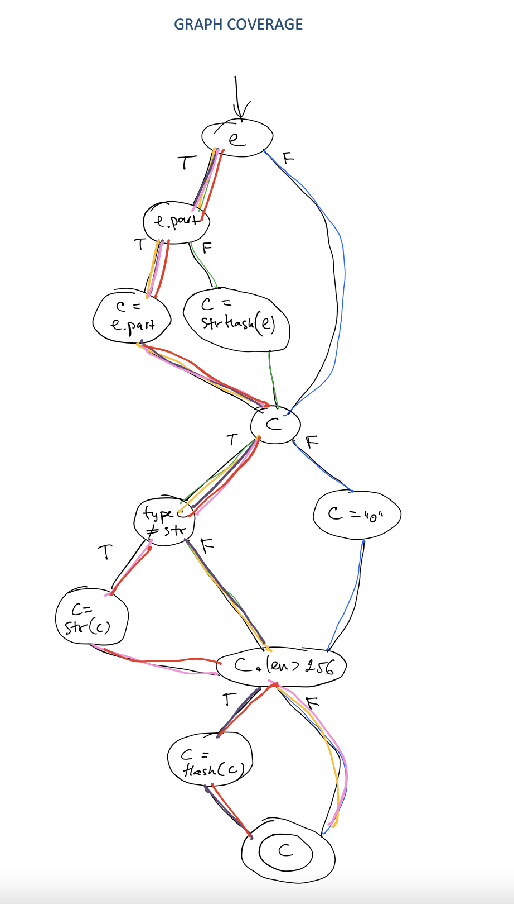

# Task: Refactoring and unit testing

You've been asked to refactor the function `deterministicPartitionKey` in [`dpk-start.js`](dpk-start.js) to make it easier to read and understand without changing its functionality into `dpk.js`. For this task, you should:

1. Write unit tests to cover the existing functionality and ensure that your refactor doesn't break it. We typically use `jest`, but if you have another library you prefer, feel free to use it.
2. Refactor the function to be as "clean" and "readable" as possible. There are many valid ways to define those words - use your own personal definitions, but be prepared to defend them. Note that we do like to use the latest JS language features when applicable.
3. Write up a brief (~1 paragraph) explanation of why you made the choices you did and why specifically your version is more "readable" than the original.

## Solution

1. Created unit tests [dpk.test.js](dpk.test.js)  
2. Refactored code [dpk.js](dpk.js)  
> - Partitioned input domain into blocks and created unit tests using edge coverage criteria.
> - For each of the blocks, if the function returns a trivial value it does so immediately.  
> - If input types determine return values, grouped them into common control flow branches.  
> - Factored out digest computation into a function. 
> - Reduced the scope of the helper variable `candidate`.  

